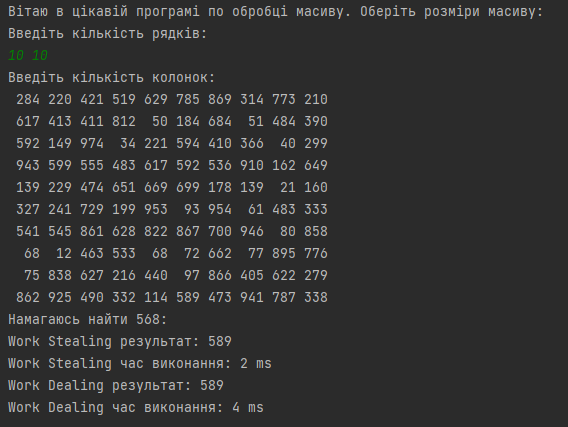
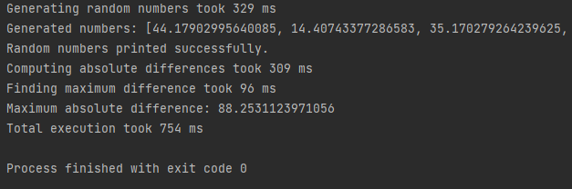

4-та практична. Варіант 3. Виконав Денис Бобела ТВ-23

## Завдання

1. Напишіть програму, в якій асинхронно створіть символьний одновимірний масив на 20 значень. Потім асинхронно
   перевіряйте символи масиву на алфавітні, пробіл, табуляцію та все інше, перезаписуючи їх в окремі нові масиви. Також
   продемонструйте роботу методу thenAcceptAsync(). Початковий масив і результати потрібно виводити на екран асинхронно.
   Також після завершення кожної асинхронної задачі потрібно виводити на екран час, витрачений на її виконання.
2. Напишіть програму, в якій асинхронно виконайте усі необхідні дії. Ввести послідовність дійсних чисел та обчислити .
   Початкову послідовність генерувати рандомно, кількість елементів = 20. Початкову послідовність та результат вивести
   на екран. До кожного виводу додавати відповідне інформаційне повідомлення. В кінці вивести час роботи усіх
   асинхронних операцій.

## Виконання

Перше завдання знаходиться в [src/Task_3/subtask_1](src/Task_3/subtask_1).

Друге завдання знаходиться в [src/Task_3/subtask_2](src/Task_3/subtask_2).

Обидва завданяя використовують функцій з пакету [Utils](src/Task_3/Utils). Клас **CalcTime** містить статичні методи для
зручного обрахунку часу виконання окремих ділянок коду. Клас **SimulateDelay** використовується для симуляції роботи
процесора.

### Перше завдання

Генерація масиву відбувається асинхронно з використанням допоміжної функції
класу [RandomChar](src/Task_3/subtask_1/Utils/RandomChar.java).

Сам масив обробляється асинхронно, а результат поділяється на три підмасиви: масив літер, масив пробілів та масив інших
символів.

Результат виконання:

### Друге завдання

У цьому завданні генерується масив дійсних чисел. Після цього над ним виконуються дві операції - пошук суми
та середьного значення. Обидві операції виконуються асинхронно. Після цього виводиться результат.

Результати:

