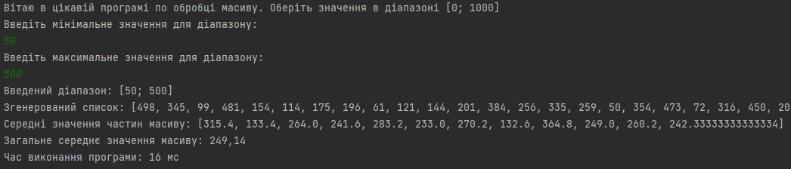

Друга практична. Варіант 3. Виконав Денис Бобела ТВ-23

## Завдання

Напишіть програму, яка асинхронно обробляє великий масив чисел для обчислення середнього значення масиву. Розбивайте
масив на частини і обробляйте кожну частину в окремому потоці.
Діапазон [0; 1000] – цілі числа. Використати CopyOnWriteArraySet.

## Виконання

Роботу програми можна розділити на 3 етапи:

- Обробка користувацького вводу
- Розділення масиву на підмасиви
- Збір результатів

### Користувацький ввід

Обробка користувацького вводу здійснюється за допомогою класу **UserRange** та методу **getUserRange()**, який повертає
об'єкт класу **Range** з полями **min** та **max**. За допомогою **try/catch** забезпечується коректність вводу.

### Розділення масиву на підмасиви

Розділення відбувається в циклі. Кожен підмасив має довжину **chunkSize**. Далі створюється **Future** та додається у **
ExecutorService**.

### Збір результатів

Збір результатів здійснюється у циклі за допомогою методів **isDone()** та **isCanceled()**. Результати додаються у
потокобезпечну колекцію **CopyOnWriteArraySet**.

### Utils

У роботі також використовуються додаткові класи з пакету utils:
- **Average** - для отримання середнього значення масиву
- **RandomList** - для заповнення списку випадковими значеннями з діапазону

## Приклад виконання

