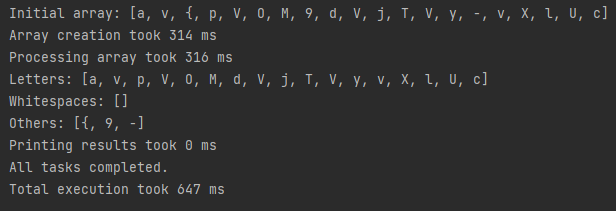

Третя практична. Варіант 3. Виконав Денис Бобела ТВ-23

## Завдання

1. Знайти мінімальний елемент у двовимірному великому масиві, значення якого вдвічі більше першого згенерованого
   елементу. Кількість елементів масиву, має задавати користувач. Значення елементів генеруйте рандомно. У результаті на
   екран має бути виведено згенерований масив, результат виконання задачі та час роботи програми.
2. Напишіть програму, яка буде проходити по файлам певної директорії та знаходити усі файли текстового формату та читати
   їх вміст, підраховуючи кількість символів. Директорію має обирати користувач. У результаті потрібно виводити ім’я
   файлу та кількість символів у ньому.

## Виконання

Перше завдання знаходиться в [src/Task_3/subtask_1](src/Task_3/subtask_1).

Друге завдання знаходиться в [src/Task_3/subtask_2](src/Task_3/subtask_2).

### Перше завдання

Для реалізації Work Stealing було використано ForkJoinPool. Деталі реалізації у
класі [WorkSteal](src/Task_3/subtask_1/WorkSteal.java).

Для реалізації Work Deal використано FixedThreadPool. Деталі реалізації у
класі [WorkDeal](src/Task_3/subtask_1/WorkDeal.java).

Результат виконання:

Як бачимо Work Stealing справився швидше. Попробуємо задати більший масив:

У цьому випадку Work Dealing справився швидше. Так відбувається тому, що Work Dealing займає деякий час на розподіл усіх
задач, але не витрачає часу на координацію і "крадіжку" потоків. Тому він швидший при великій матриці.

### Друге завдання

Виконано було за допомогою Work Stealing та ForkJoinPool тому, що такий підхід цікавіший та сподобався мені більше.

Основні класи:

- [DirectoryProcessorTask](src/Task_3/subtask_2/Tasks/DirectoryProcessorTask.java) - Рекурсивне завдання, яке сканує
  файли в директорії та кожне з них оброблює в FileProcessorTask.
- [FileProcessorTask](src/Task_3/subtask_2/Tasks/FileProcessorTask.java) - Завдання, що виконує підрахунок символів у
  файлі.

Результати:

