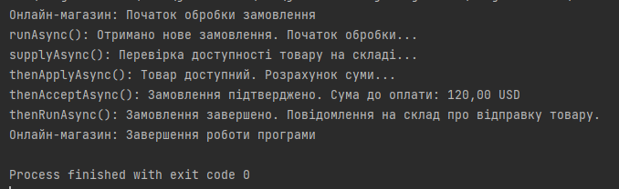

Четверте практичне заняття. Виконав Денис Бобела ТВ-23

## Опис

Цей код описує спрощенну роботу системи онлайн-магазину.

- `runAsync()` імітує обробку нового замовлення.
- `supplyAsync()` перевіряє, чи доступний товар на складі. (імітація через Thread.sleep).
- `thenApplyAsync()` обчислює суму до оплати з урахуванням базової ціни та податку.
- `thenAcceptAsync()` повідомляє клієнта про підтвердження замовлення та суму.
- `thenRunAsync()` завершує процес і повідомляє склад про відправку товару.

## Результати

